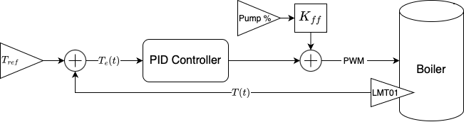

#  RaspberryLatte 

A full stack suite to add smarts to a single boiler espresso machine using a Raspberry Pi Pico as the brains. The project was started with the following goals in mind:
- **Feature Rich:** Going beyond the standard PID temperature control, RaspberryLatte should provide advanced features that make pulling the perfect shot easier. These include
  - PID temperature control with feedforward components
  - Automatic flow control
  - Output scale
  - Preinfusion and autobrew routines
  - Coffee profiles
  - Scheduled heating *[Planned]*
  - Realtime state viewer (mobile UI) *[Planned]*
  - Machine statistic tracking *[Planned]*
  - Shot diagnosis and logging  *[Planned]*
- **Low Cost:** The cost should be minimized. The base hardware should be less than $100.
- **Discreet Appearance:** External parts, which would typically be 3D printed, should be minimized. Furthermore, the design should not require any external displays. In other words, the finished product should be discreet and not *look* like a DIY IoT device. 

## Features
### Advanced Temperature Control
Uses a PID controller with a feed-forward component to regulate the boiler's temperature. The resulting temperature is within 1% the setpoint throughout the shot.

  

### Autobrew Routines with Flow Control
Automatically runs user configured brew routines. These will regulate the pump's power so that a desired flow rate is maintained over the course of the shot.

  

### User Adjustable Settings
The temperatures, flow rate, preinfusion routine, dose, yield, and other settings can all be customized without reflashing the code. The pump switch and mode dial are used to navigate a folder structure while the three LEDs display the current values of the parameters as they are adjusted. This allowed for full customization without any additional hardware (e.g. screens, buttons, etc.). 

## Project Architecture 

This project can be thought of in several layers. 
### Hardware Level
The lowest level is the hardware such as sensors and switches required to create a smart espresso machine. Additionally, a custom carrier board is needed to interface with these components. This PCB contains any circuitry required to support the sensors and switches. Mounted to this carrier board is the Raspberry Pi Pico W.
| Front View | Back View |
| --- | --- |
 | 

  
### Firmware Level
The next level consists of the firmware running on the Pico. This code, written in c, contains all the sensor drivers and machine logic. The firmware is partitioned onto a single core of the dual core Pico.
### Network Level (Planned)
The network level runs on the second core on the Pico. It collects information from the firmware running on core 0 and shares that over BLE with the Mobile UI level (see below). It also passes settings received from a BLE client to the firmware so that the machines performance can be tailored to achieve the desired brew characteristics.
### Mobile UI Level (Planned)
While ssh is fun, a mobile application would be significantly more convenient. This level would allow users to create and share their brew profiles for different coffees, visualize a shot's flow rate, pressure, temperature, etc. in real time, and troubleshoot their shots. This application would interface with the Network level using BLE, simplifying the connection process.

## To-Do
- [x] Add carrier board design to repository
- [x] Add UI based on onboard switches and LEDs
- [x] Add flow control to autobrew routines
- [ ] Add wiring diagram
- [ ] Add BOM for hardware
- [ ] Implement network leve
- [ ] Implement mobile UI level
- [x] Design logo
- [ ] Write project documentation

## Documentation
### Project Documentation (Under Construction)
To help with your build, project documentation is being written in another [repository](https://github.com/hallboyone/RaspberryLatte-docs). Clone and build the sphinx docs to view.

  

### Code Documentation
The documentation is generated from the code's comments using doxygen. Below is a sample page showing the autobrew library. Clone and build the html to view the rest.

  

## Inspiration
This project has taken inspiration from others who have taken the time to write up their own builds. The two primary sources have been the [Es(pi)resso project](https://home-automations.net/project-coffee-espiresso-machine/), and the [Espresso for Geeks blog](https://www.instructables.com/Espresso-for-Geeks/). Big thank you to both those makers for sharing the great work they did!

## Contribute
If you are interested in helping with this project, I would love to talk! You can reach me through [Twitter](https://twitter.com/hallboyone "Richard Hall").
